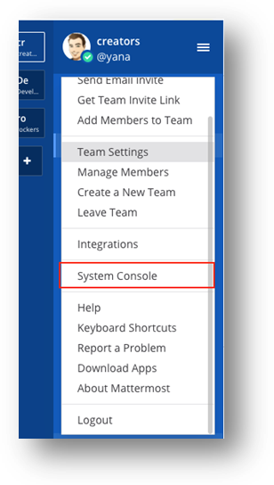

Mattermost 用户指南

# 简介

Mattermost
是一款易于使用、经过简化且可扩展的团队通信和企业消息传送系统。Mattermost
可以让您的团队在一处完成所有通信，而且随时随地可供搜索和使用。您可以在
QNAP NAS 上创建自己的私人托管聊天解决方案。\
Mattermost
应用程序实现了团队在一处完成所有通信，所有人都可以更轻松地在组内或私人聊天内一起讨论问题。Mattermost
的专用和公共频道功能可以实现上述目的，该功能将在本文档的后续部分进行介绍。本文档还介绍了如何安装和开始使用
Mattermost。

# 安装

用浏览器打开<http://10.20.110.21/soft/mattermost/5.0.4/>
根据操作系统下载安装Mattermost客户端。

{width="5.768055555555556in"
height="3.827777777777778in"}

## 开始使用

### 添加服务器地址

安装之后，打开{width="1.25in"
height="1.1458333333333333in"} Mattermost 应用程序。此时会弹出以下窗口.
{width="5.768055555555556in" height="4.5625in"}

-   **Server Display Name:** dataexa

-   **Server URL:** http://192.168.1.110:8065

### 注册账号

添加服务器地址后，弹出下面登录界面。

{width="5.111961942257218in"
height="3.5257502187226595in"}

首次登录Mattermost，选择【现在创建一个】自助创建账号。

{width="5.303438320209974in"
height="5.588211942257218in"}

-   **您的电子邮箱地址是什么，**输入你的邮箱账号。

-   **选择您的用户名，**输入你在邮件账号。

-   **输入一个安全密码，**然后单击下方的（创建帐户）按钮。

{width="12.133333333333333in"
height="8.75in"}

系统将提示您输入团队名称，输入待创建团队的名称后，单击"Next"（下一步）。

您也可以注册，然后使用管理员提供的团队 URL 直接加入已经存在的团队。（URL
将在下一步中生成）。

{width="12.133333333333333in"
height="8.516666666666667in"}

系统将生成一个 URL，您可以将此 URL
提供给您的团队成员，也就是您希望加入您创建的团队的人员。

他们收到此 URL 后，便可加入您的团队，注册过程与之前所述类似。

您可以根据自己的喜好和需要来编辑 Web 地址，以便与团队共享。

{width="12.15in"
height="8.541666666666666in"}

单击"Finish"（完成）后，您将转到消息传送界面。\
您可以访问和创建频道。\
可以选择是创建公共频道还是专用频道。

{width="9.091666666666667in"
height="6.658333333333333in"}

### 设置自身状态

在频道列表顶部单击自己的头像后，会出现一个下拉菜单。通过从该菜单中选择一种状态，您可以将自已的状态设置为"Online"（在线）、"Away"（离开）或"Offline"（离线）。

{width="2.3333333333333335in"
height="1.3666666666666667in"}

### 注销

您可以从"**Main
Menu**"（主菜单）中注销，单击屏幕左侧顶部标题中的三条短线即可访问该菜单。单击"**Logout**"（注销）后，系统会将您从服务器的所有团队中注销。

{width="3.6416666666666666in"
height="6.858333333333333in"}

## 频道

"**Channels**"（频道）用于组织不同主题之间的对话。它们对您团队中的所有成员开放。要发送私人通信，单人请使用"**Direct
Messages**"（直接消息），多人请使用"**Private Channel**"（专用频道）。

单击"**More\...**"（更多\...），创建一个新频道或加入现有频道。\
也可以通过单击公共或专用频道标题旁的**"+"符号**来创建新频道。

### 频道类型

Mattermost 具有的频道功能可组织不同主题之间的对话。\
频道分为三种类型："Public Channels"（公共频道）、"Private
Channels"（专用频道）和"Direct Messages"（直接消息）。

{width="2.3666666666666667in"
height="4.05in"}

# 公共频道

"Public Channels"（公共频道）对团队中的所有成员开放。\
默认情况下，新团队成员在注册之后会自动加入两个公共频道："Town
Square"（广场）和"Off-Topic"（讨论区）。

### 2.专用频道

"Private
Channels"（专用频道）用于敏感主题，仅对选定的团队成员可见。"Private
Channels"（专用频道）的任何成员均可添加其他成员。频道成员可以随时选择离开，但只有频道所有者或团队管理员可以移除其他成员。

### 3.直接消息和组消息

"Direct Messages"（直接消息）用于二人之间的对话。"Group
Messages"（组消息）是三人或更多人之间对话的"Direct
Messages"（直接消息）。这两种消息都只对参与对话的人员可见。\
如果要与另外一个人进行私人对话，请使用"Direct Messages"（直接消息）。

如果要与最多七个其他参与者建立对话，可以使用"Group
Messages"（组消息）。如果其他参与者多于七人，则必须创建专用频道。\
如果系统管理员容许，您可以与其他团队（而不仅仅是自己所在团队）中的人员之间发起"Direct
Messages"（直接消息）或"Group Messages"（组消息）。

"Direct
Messages"（直接消息）列表中的名称旁边还有一个在线状态指示符，用于显示"Online"（在线）（浏览器处于活动状态）、"Away"（离开）（浏览器
5 分钟无活动）或"Offline"（离线）（浏览器关闭）。

### 管理频道

您可以创建、加入、重命名、离开和删除频道。

### 创建频道

选择左侧"Public Channels"（公共频道）或"Private
Channels"（专用频道）标题旁的 {width="0.20833333333333334in"
height="0.2in"} 符号，可以创建一个新的公共频道或专用频道。要发起直接消息会话，请单击"Direct
Messages"（直接消息）列表底部的"**More**"（更多），查看您可以向其发送消息的团队成员的列表。任何人都可以创建"Public
Channels"（公共频道）或"Private
Channels"（专用频道），除非权限受到系统管理员的限制。

{width="1.0166666666666666in"
height="0.3416666666666667in"}

### 加入频道

单击"Channels"（频道）列表底部的"**More**"（更多），可以查看您可以加入的公共频道的列表。要加入某个专用频道，需要该频道中的成员对您进行添加。

### 向频道中添加成员

单击中间窗格顶部的频道名称以访问下拉菜单，然后单击"**Add Members**"（添加成员）。频道中的任何成员均可通过单击用户名旁的"**Add**"（添加）来添加新成员。已添加到频道中的用户不会显示在此模式中。

### 从频道中移除成员

单击中间窗格顶部的频道名称以访问下拉菜单，然后单击"**Manage
Members**"（管理成员）。频道中的任何成员均可通过单击用户名旁的"**Remove**"（移除）来移除其他成员。

{width="3.7416666666666667in"
height="3.125in"}

### 重命名频道

单击中间窗格顶部的频道名称以访问下拉菜单，然后单击"**Rename
Channel**"（重命名频道）。任何人均可重命名自己所在的频道，除非权限受到系统管理员的限制。\
重命名频道时，您还可以更改频道 URL（也称为频道句柄）。更改频道 URL
可能会断开现有链接。

{width="1.9666666666666666in"
height="3.5833333333333335in"}

### 离开频道

单击中间窗格顶部的频道名称以访问下拉菜单，然后单击"**Leave
Channel**"（离开频道）。离开专用频道的团队成员若想重新加入，则必须由频道成员重新添加。团队成员不会收到自己不是成员的频道的提及通知。

### 删除频道

单击中间窗格顶部的频道名称以访问下拉菜单，然后单击"**Delete
Channel**"（删除频道）。\
任何人均可删除自己所在的"Public Channels"（公共频道）或"Private
Channels"（专用频道），除非权限受到系统管理员的限制。\
频道删除后会从用户界面中移除，但服务器上仍有存档副本供后期审核使用。

鉴于此原因，新创建的频道的 URL 不能与已删除频道的 URL 同名。

### 收藏频道

收藏频道是一个很好的边栏组织方式，您可以选择哪些频道、专用频道和直接消息对您最重要。

要将频道标记为收藏频道，只需打开频道，然后单击显示在频道名称左侧的星星即可

{width="2.7916666666666665in"
height="0.7833333333333333in"}

## 消息传送

### 发送消息

您可以使用 Mattermost 底部的文本输入框编写消息。

{width="12.133333333333333in"
height="1.7583333333333333in"}

按 ENTER 可发送消息。使用 SHIFT+ENTER 可以换行，而不发送消息。

### 回复消息

您也可以单击消息文本旁的回复箭头来回复特定消息。

{width="0.7166666666666667in"
height="0.3333333333333333in"}

您可以对特定消息进行评论和回复，系统将会创建一个与此消息相关的新会话，该会话包含所有回复和评论，将显示在消息聊天界面上。

### 提及团队成员

您可以通过键入以下内容在需要某个团队成员时向其发出通知： 

{width="0.7416666666666667in"
height="0.225in"}

键入 **@** 可调出可以被提及的团队成员的列表。要筛选该列表，请键入任意用户名、名字、姓氏或昵称的前几个字母。使用向上和向下键可以滚动浏览列表中的条目，然后按
ENTER 选择要提及的人员。选定后，用户名将会替换全名或昵称。

以下示例将向
Matthew（其用户名为 **Matthew**）发送一条专门的提及通知。该通知提醒她注意提及她的频道和消息。

如果 Mathew 未打开 Mattermost
且开启了电子邮件通知，则会收到一封关于提及她并附有消息文本的电子邮件警报。

{width="7.408333333333333in"
height="1.175in"}

如果您提及的某人不属于该频道，则会发布一条系统消息告知您。此消息是临时消息，只有您自己才能看到。要向频道中添加被提及的人员，请转到频道名称旁的下拉菜单并选择"**Add
Members**"（添加成员）。

**\@channel 和 \@all**\
您可以通过键入 \@channel 或 @all
来提及整个频道。频道中的所有成员都会收到提及通知，通知方式与分别提及每个成员相同。如果在"Town
Square"（广场）中使用，则将通知您团队中的所有成员。\
\@channel
本周的面试非常成功。我认为我们找到了一些非常出色的潜在候选人！\
如果某个频道有五个或更多成员，系统将提示您确认要将通知发送给频道中的所有人。

**\@here**\
键入 @here
可以提及频道中在线的所有人。此时会发送一个桌面通知并将通知推送给频道中的每个在线成员。在边栏中会将其计为一次提及。离线成员不会收到通知，返回站点时也不会看到频道边栏中统计了此次提及。对于离开的成员，只有将通知设置为"all
activity"（所有活动）时才会收到桌面通知，但他们不会看到边栏中统计了此次提及。\
\@here 有人可以马上看一下这个问题吗？

**提及触发词**\
您可以在"**Account
Settings"（帐户设置）\>"Notifications"（通知）\>"Words that trigger
mentions"（提及触发词）**中自定义触发提及通知的词。默认情况下，您会收到针对您的用户名以及针对 *\@channel*、*\@all* 和 *\@here* 的提及通知。您可以选择让自己的名字成为触发提及的词。\
您可以添加一列自定义词来接收相关的提及通知，方法是在输入框中键入这些词，词之间用逗号分隔。如果您希望收到关于特定主题（例如"面试"或"营销"）的所有帖子的通知，此方法非常有效。

**最新通知**\
单击搜索框旁的 **@** 可以查询您的最新
\@提及和触发提及的词。单击右侧边栏中搜索结果旁的"**Jump**"（跳转）可以跳到频道中央窗格和具有提及的消息所在的位置。

{width="6.25in"
height="2.925in"}

### 共享文件

在 Mattermost 中，可随消息附加以下类型的文件：

1.  图像：BMP、GIF、JPG、JPEG、PNG、SVG

2.  视频：MP4

3.  音频：MP3、M4A

4.  文件：PDF、TXT

### 如何附加文件

可通过下列方式附加文件：

-   使用附件图标 - 单击消息输入框内的曲别针图标（右侧）

-   拖放

-   从剪贴板粘贴

### 文件预览器

Mattermost 内置了文件预览器，可用于以下目的：

-   下载文件

-   共享公开链接

-   查看媒体

单击附加文件的缩略图，可在文件预览器中打开此文件。

下载文件\
可通过单击文件缩略图旁的下载图标来下载附加文件。

### 共享公开链接

利用公开 URL，您可以与 Mattermost
系统外部的任何人共享附件。要共享附件，单击附件的缩略图，然后单击"**Get
Public Link**"（获取公开链接）。\
如果文件预览器中未显示"**Get Public
Link**"（获取公开链接），而您想要启用该功能，可在"System
Console"（系统控制台）的**"Security"（安全性）\>"Public
Links"（公开链接）**下请求系统管理员启用此功能。

注意：Mattermost 仅支持每个帖子最多附加五个文件，最大文件大小为 50
MB。只有系统管理员才能增加分配的大小。

### 标记消息

您可以标记消息以便后续跟进。

要进行标记，请将鼠标悬停在消息上以显示标记图标。单击该图标以标记要跟进的消息。

{width="4.691666666666666in"
height="2.5in"}

单击搜索框旁的标记可以查看已标记消息的列表。

{width="5.05in"
height="3.3in"}

要从已标记列表中移除某项，请单击消息旁的标记将其清除。

{width="4.166666666666667in"
height="1.7833333333333334in"}

### 固定消息

频道中的任何成员均可将重要或有用的消息固定到此频道。固定消息的列表对所有频道成员可见。

已固定的消息标有"Pinned"（已固定）图标 {width="0.5in"
height="0.2in"}。

{width="1.9916666666666667in"
height="2.466666666666667in"}

要固定消息**：**

1.  将鼠标悬停在要固定的消息之上。此时会出现 \[\...\] 链接。

2.  单击 **\[\...\]\>"Pin to channel"（固定到频道）**

### 要取消固定消息：

1.  将鼠标悬停在要取消固定的消息之上。此时会出现 \[\...\] 链接。

2.  单击 **\[\...\]\>"Un-pin from channel"（从频道取消固定）**

## 团队管理

如果系统管理员已通过"System Console"（系统控制台）将"**Enable Team
Creation**"（启用团队创建）设置为 true，任何人均可创建新团队。

{width="7.341666666666667in"
height="6.941666666666666in"}

如果系统管理员启用了团队创建，则可从团队边栏或主菜单创建团队。团队的创建人将成为团队的团队管理员。

单击团队边栏底部的 {width="0.20833333333333334in"
height="0.2in"} 图标，会转到一个页面，从中可输入团队名称并为新团队选择
URL。如果您在菜单中无法看到此选项，则表明系统管理员已禁用团队创建。

{width="3.3666666666666667in"
height="4.658333333333333in"}

## 主菜单

也可以从主菜单创建团队，单击"**Main Menu**"（主菜单）\>"**Create a New
Team**"（创建新团队）即可。

{width="3.725in"
height="6.7in"}

如果您在菜单中无法看到此选项，则表明系统管理员已禁用团队创建。

## 管理成员

### 邀请

如果系统管理员已启用添加，您便可通过下列三种方式之一向团队添加人员：您可以发送直接邀请，也可以共享公开团队邀请链接；如果他们在服务器上已有帐户，则您可自行将其添加到团队中。

### 直接邀请

人员将收到从您团队的服务器直接发送到其电子邮件地址的邀请。邀请内有一个链接，可将这些人员带至帐户创建页面。

### 发送直接邀请：

1.  在"Navigation Panel"（导航面板）的顶部，单击您的用户名。

2.  单击"**Send Email
    Invite**"（发送电子邮件邀请），并输入人员的电子邮件地址及其名字和姓氏。

3.  要邀请多个人，请单击"**Add another**"（添加其他人），然后单击"**Send
    Invitation**"（发送邀请）。

**团队邀请链接**

团队邀请链接是将人员定向至团队帐户创建页面的唯一
URL。团队邀请链接可供任何人使用，除非团队管理员或系统管理员通过**"Team
Settings"（团队设置）\>"General"（常规）\>"Invite
Code"（邀请码）**重新生成链接，否则不会更改。例如，您可以将团队邀请链接加入发给全公司的电子邮件中，邀请所有员工加入
Mattermost 团队。

**获取团队邀请链接**：

1.  在"Navigation Panel"（导航面板）的顶部，单击您的用户名。

2.  单击"**Get Team Invite Link**"（获取团队邀请链接）。

3.  在打开的窗口中，复制该链接并将其分享给要邀请加入团队的人。

**向团队添加人员**

如果要添加至团队的人员在服务器上已有帐户，则您无需发送邀请即可将其添加到团队中。

**向团队添加人员**：

1.  在"Navigation Panel"（导航面板）的顶部，单击您的用户名。

2.  单击"**Add Members to Team**"（向团队添加成员）。此时会打开"Add New
    Members"（添加新成员）窗口。

3.  单击要添加至团队的人员的用户名。您可以在搜索框中键入内容以筛选列表。如果您要添加的人员不在列表中，则表示他们已在团队中，或者在服务器上尚无帐户。

### 角色

Mattermost 中有下列四种类型的用户角色，分别具有不同的权限级别：\
系统管理员、团队管理员、成员和非活动帐户。要查看团队的用户及其角色列表，团队管理员可以转到
\[\...\]"**Main Menu**"（主菜单），然后选择"**Manage
Members**"（管理成员）。

### 成员

用户加入团队后，其默认角色即为成员。成员具有 Mattermost 团队的基本权限。

### 频道管理员

频道创建者会获得该频道的频道管理员角色。具有频道管理员角色的人可以执行以下操作：

-   将频道管理员角色分配给频道中的其他成员。

-   移除拥有频道管理员角色的其他成员的频道管理员角色。

-   从频道中移除成员。

根据系统配置，可以为频道管理员授予系统管理员所具有的重命名频道和删除频道的特殊权限。

### 团队管理员

创建团队时，该团队的建立者即为团队管理员。某个人在一个团队中可以是团队管理员，但在另一团队中只能是普通成员。团队管理员可以访问的菜单和执行的操作如下：

-   团队站点主菜单中的"Team Settings"（团队设置）菜单

-   更改团队名称和从 Slack 导出文件导入数据

-   "Manage
    Members"（管理成员）菜单，可在此处控制团队成员是"成员"还是"团队管理员"

## 系统管理员

添加到新安装的 Mattermost 系统中的第一个用户会获得系统管理员角色。\
系统管理员通常是一名 IT
人员，具有团队管理员的所有权限，能够执行的操作和访问的内容如下：

-   任何团队站点主菜单中的"System Console"（系统控制台）

-   更改"System Console"（系统控制台）中提供的 Mattermost
    服务器的任何设置

-   将其他用户提升为系统管理员角色或从该角色降级

-   停用用户帐户以及将其重新激活

-   专用频道，前提是获得专用频道的链接

## 从团队中移除用户或离开团队

### 从团队中移除

任何团队管理员均可从团队中移除用户，方法是转到 \[\...\]**"Main
Menu"（主菜单）\>"Manage
Members"（管理成员）**，然后在用户条目旁的下拉菜单中选择"**Remove From
Team**"（从团队移除）。

用户从某个团队中移除后，其团队边栏中将不再显示该团队。如果他们当前已打开该团队，则其会重定向至团队边栏中显示的第一个团队。如果他们不属于任何其他团队，则会将其转至团队选择页面。

系统管理员也可以从团队中移除用户，方法是转到**"System
Console"（系统控制台）\>"Users"（用户）**，然后选择用户条目旁的下拉菜单并单击"**Manage
Teams**"（管理团队）。

### 离开团队

用户也可以选择从团队中移除自已，方法是转到 \[\...\]**"Main
Menu"（主菜单）\>"Leave
Team"（离开团队）**。这会将用户从团队及此团队的所有公共频道和专用频道中移除。\
只有在团队设置为"Allow any user with an account on this server to join
this
team"（允许在此服务器上具有帐户的任何用户加入此团队）或者用户收到新邀请时，他们才能重新加入团队。如果重新加入，他们也不再是原有频道中的成员。

## 系统控制台

您可以通过**"Main Menu"（主菜单）\>"System
Consol"（系统控制台）**转到系统控制台。

{width="3.2083333333333335in"
height="5.666666666666667in"}

## 电子邮件通知：

在"System
Consol"（系统控制台）菜单左侧的"Notifications"（通知）选项卡下，单击"**Email**"（电子邮件）。

{width="10.808333333333334in"
height="6.308333333333334in"}

您可根据需要将电子邮件通知设置为 true 或 false。

需设置 SMTP 电子邮件服务器才能启用电子邮件通知

{width="13.325in"
height="6.833333333333333in"}

### SMTP 电子邮件设置步骤

要在生产环境中运行，Mattermost 需要针对电子邮件通知启用 SMTP
电子邮件并使用基于电子邮件的身份验证为系统重置密码。

### 如何启用电子邮件

要启用电子邮件，请按如下步骤配置 SMTP 电子邮件服务：

1.  **设置 SMTP 电子邮件发送服务**（如果您还没有 SMTP 服务及凭据）

    -   您可以使用任何 SMTP
        电子邮件服务，只需下列信息即可：服务器名称、端口、SMTP 用户名和
        SMTP 密码。

        -   如果您没有 SMTP 服务，可按以下简单说明使用 [[Amazon
            简单电子邮件服务 (Simple Email Service,
            SES)]{.underline}](https://aws.amazon.com/ses/) 进行设置：

            i.  转到 [[Amazon SES
                控制台]{.underline}](https://console.aws.amazon.com/ses)，然后转到"SMTP Settings"（SMTP 设置）\>"Create My SMTP Credentials"（创建我的 SMTP 凭据）

            ii. 复制服务器名称、端口、SMTP 用户名和
                SMTP 密码，供下面的第 2 步使用。

            iii. 在"Domains"（域）菜单中设置新域并对其进行验证，然后针对该域启用"GenerateDKIM Settings"（生成
                 DKIM 设置）。

                 -   Mattermost 建议为您的电子邮件域设置发件人策略框架
                     (Sender Policy Framework, SPF) 和/或域密钥识别邮件
                     (Domain Keys Identified Mail, DKIM)。

                 -   选择类似 mattermost@example.com
                     的发件人地址，然后单击"Send a TestEmail"（发送测试电子邮件）以确认设置能够正常工作。

2.  **配置 SMTP 设置**

    -   打开"**System
        Console**"（系统控制台），方法是登录到现有团队并从主菜单访问"System
        Console"（系统控制台）。\
        \
        或者，如果还没有任何团队，请在浏览器中转到
        http://dockerhost:8065/，创建一个团队，然后单击主菜单中的"**System
        Console**"（系统控制台）\
         

    -   转到"**Authentication**"（身份验证）\>"**Email**"（电子邮件）选项卡并配置以下内容：\
        **Allow Sign Up With Email**（允许使用电子邮件注册）：true

    -   转到"**Notifications**"（通知）\>"**Email**"（电子邮件）选项卡并配置以下内容：

        -   **Send Email Notifications**（发送电子邮件通知）：true

        -   **Notification Display
            Name（通知显示名称）：**发送通知的电子邮件帐户的显示名称

        -   **Notification Email
            Address（通知电子邮件地址）：**在用于发送通知的电子邮件帐户上显示的电子邮件地址

        -   **SMTP Username**（SMTP 用户名）：第 1 步中的 SMTP 用户名

        -   **SMTP Password**（SMTP 密码）：第 1 步中的 SMTP 密码

        -   **SMTP Server**（SMTP 服务器）：第 1 步中的 SMTP 服务器

        -   **SMTP Port**（SMTP 端口）：第 1 步中的 SMTP 端口

        -   **Connection Security**（连接安全）：TLS（建议）

        -   然后单击"**Save**"（保存）

        -   然后单击"**Test Connection**"（测试连接）

        -   如果测试失败，请在"**OTHER**"（其他）\>"**Logs**"（日志）中查看是否有
            \[EROR\]/api/v3/admin/test_email \... 之类的错误

### 示例 SMTP 设置

**Amazon SES**

-   将"**SMTP Username**"（SMTP 用户名）设置为 **\[您的 SMTP 用户名\]**

-   将"**SMTP Password**"（SMTP 密码）设置为 **\[您的 SMTP 密码\]**

-   将"**SMTP Server**"（SMTP
    服务器）设置为 **email-smtp.us-east-1.amazonaws.com**

-   将"**SMTP Port**"（SMTP 端口）设置为 **465**

-   将"**Connection Security**"（连接安全）设置为 **TLS**

**Postfix**

-   确保在安装 Mattermost 的计算机上安装了 Postfix

-   将"**SMTP Username**"（SMTP 用户名）设置为**（空）**

-   将"**SMTP Password**"（SMTP 密码）设置为**（空）**

-   将"**SMTP Server**"（SMTP 服务器）设置为 **localhost**

-   将"**SMTP Port**"（SMTP 端口）设置为 **25**

-   将"**Connection Security**"（连接安全）设置为**（空）**

**Gmail**

-   将"**SMTP Username**"（SMTP
    用户名）设置为 **您的电子邮件@gmail.com**

-   将"**SMTP Password**"（SMTP 密码）设置为 **您的密码**

-   将"**SMTP Server**"（SMTP 服务器）设置为 **smtp.gmail.com**

-   将"**SMTP Port**"（SMTP 端口）设置为 **587**

-   将"**Connection Security**"（连接安全）设置为 **STARTTLS**

**Hotmail**

-   将"**SMTP Username**"（SMTP
    用户名）设置为 **您的电子邮件@hotmail.com**

-   将"**SMTP Password**"（SMTP 密码）设置为 **您的密码**

-   将"**SMTP Server**"（SMTP 服务器）设置为 **smtp-mail.outlook.com**

-   将"**SMTP Port**"（SMTP 端口）设置为 **587**

-   将"**Connection Security**"（连接安全）设置为 **STARTTLS**

设置完 SMTP 服务器后，单击"**Save**"（保存），然后再退出系统控制台。

{width="10.725in"
height="6.241666666666666in"}

### 团队统计信息和站点统计信息

您可以在"REPORTING"（报告）选项卡下查看详细的团队统计信息，此处将显示有关用户总数、帖子总数、频道数、团队数以及每日和每月活动用户数的所有详细信息。

{width="10.766666666666667in"
height="6.283333333333333in"}
